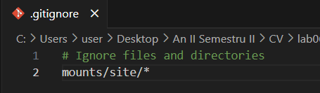
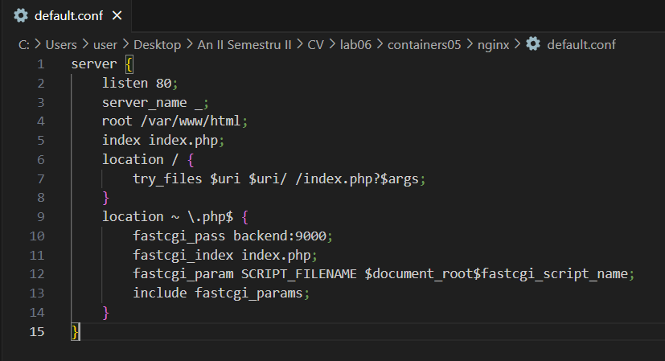
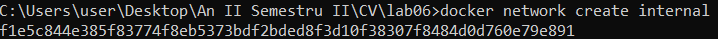
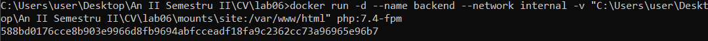
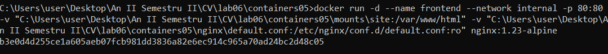
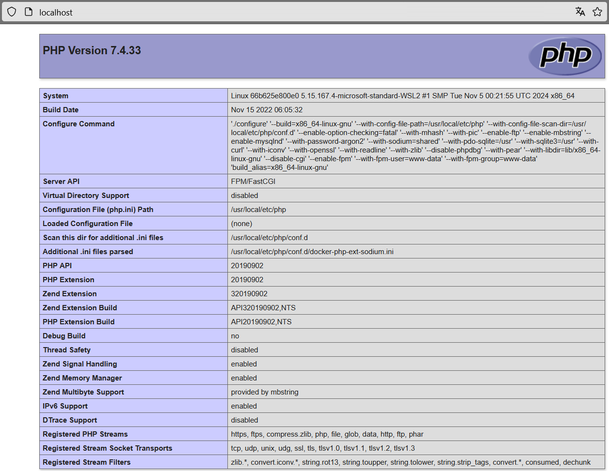

## Numele lucrării de laborator
Interacțiunea containerelor

## Scopul lucrării
După finalizarea acestei lucrări studentul va fi capabil să gestioneze interacțiunea între mai multe containere.

## Sarcina
Creați o aplicație PHP pe baza a două containere: nginx, php-fpm.
## Descrierea efectuării lucrării

### 1. Crearea directorului și a fișierului `.gitignore`

Am creat un director `containers05` și în interiorul acestuia directorul `mounts/site`, unde am copiat site-ul PHP realizat în cadrul cursului de Programare PHP. De asemenea, am adăugat fișierul `.gitignore` cu următorul conținut:

```bash
# Ignore files and directories
mounts/site/*
```



### 2. Configurarea fișierului `default.conf` pentru Nginx

Am creat fișierul `nginx/default.conf` cu următorul conținut:

```nginx
server {
    listen 80;
    server_name _;
    root /var/www/html;
    index index.php;
    location / {
        try_files $uri $uri/ /index.php?$args;
    }
    location ~ \.php$ {
        fastcgi_pass backend:9000;
        fastcgi_index index.php;
        fastcgi_param SCRIPT_FILENAME $document_root$fastcgi_script_name;
        include fastcgi_params;
    }
}
```



Acest fișier configurează serverul Nginx să redirecționeze cererile PHP către containerul `php-fpm`.

### 3. Crearea rețelei interne și a containerelor

Am creat rețeaua `internal` pentru a permite comunicarea între cele două containere.

```bash
docker network create internal
```


Am creat containerul `backend` folosind imaginea `php:7.4-fpm`, cu directorul `mounts/site` montat la `/var/www/html` și cu rețeaua `internal`.

```bash
docker run -d --name backend --network internal -v "C:\Users\user\Desktop\An II Semestru II\CV\lab06\containers05\mounts\site:/var/www/html" php:7.4-fpm
```



Am creat containerul `frontend` folosind imaginea `nginx:1.23-alpine`, cu directorul `mounts/site` montat la `/var/www/html` și fișierul `nginx/default.conf` montat la `/etc/nginx/conf.d/default.conf`. De asemenea, am expus portul 80 al containerului pe portul 80 al gazdei și l-am conectat la rețeaua `internal`.

```bash
docker run -d --name frontend --network internal -p 80:80 -v "C:\Users\user\Desktop\An II Semestru II\CV\lab06\containers05\mounts\site:/var/www/html" -v "C:\Users\user\Desktop\An II Semestru II\CV\lab06\containers05\nginx\default.conf:/etc/nginx/conf.d/default.conf" nginx:1.23-alpine
```



### 4. Testarea funcționării site-ului

Am accesat site-ul în browser la adresa `http://localhost`. Dacă a fost afișată pagina de pornire Nginx, am reîncărcat pagina pentru a verifica funcționarea corectă.



## Răspunsuri la întrebări

### 1. În ce mod în acest exemplu containerele pot interacționa unul cu celălalt?

Containerele pot interacționa între ele prin intermediul rețelei interne Docker. Containerul `frontend` (Nginx) poate comunica cu containerul `backend` (PHP-FPM) pentru a executa și a servi codul PHP.

### 2. Cum văd containerele unul pe celălalt în cadrul rețelei interne?

Containerele se află pe aceeași rețea Docker (`internal`), astfel încât acestea pot comunica între ele folosind numele containerului ca și host. De exemplu, containerul `frontend` poate accesa containerul `backend` prin `backend:9000`.

### 3. De ce a fost necesar să se suprascrie configurarea Nginx?

A fost necesar să se suprascrie configurarea Nginx pentru a specifica locațiile pentru fișierele PHP și a le redirecționa către containerul `php-fpm`. Nginx trebuie să știe cum să gestioneze cererile PHP și să le trimită către PHP-FPM, care le va procesa.

## Concluzii
Lucrarea de laborator a demonstrat modul în care se pot conecta două containere Docker pentru a crea o aplicație PHP. Configurarea rețelelor interne și montarea directorilor comune au fost esențiale pentru a asigura interacțiunea corectă între cele două containere.